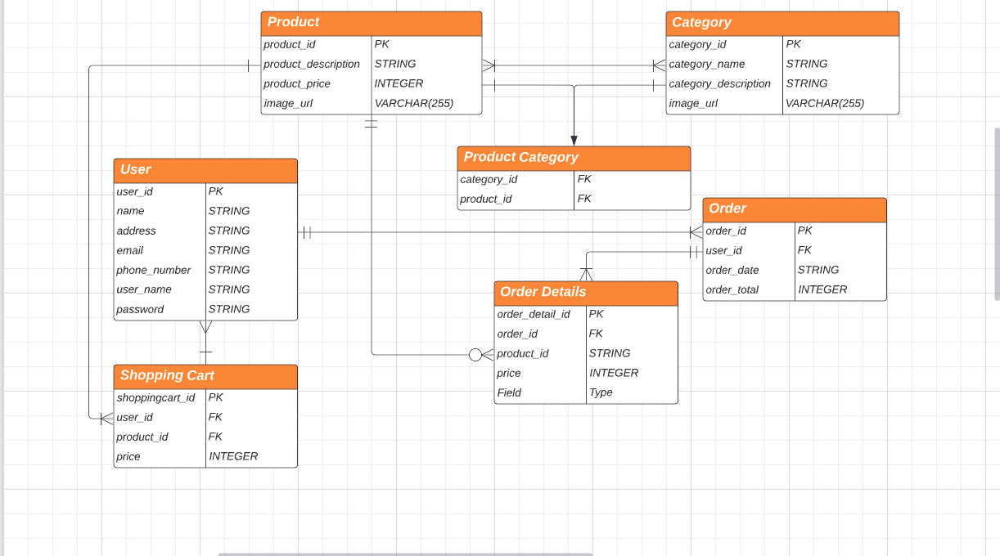

# Neweggs
This is Neweggs a completely separate and not at all similar to the popular electronic ecommerce site Newegg.com. You can buy all of your electronic here using our user-friendly gui and shopping features.

## The Team

### Tyler Carter

    
Socials

- [Github](https://github.com/bojeebs)
- [LinkedIn](https://www.linkedin.com/in/carter-tyler/)

## Technology Used
- React front End with React Redux
- Django backend with Auth
- DBeaver for database managment
- Render for backend deployment and Netlify 

## Installitons

## Key Features
1. View several different categories of products
2. Users will be able to login 
3. Add products to cart and remove them
4. Check out and have their order saved

## MVP
- 2 different categories of items
- Items that can be added or removed from cart to achieve CRUD
- Products will be passed from shopping cart to order --> order details

## Stretch Goals
- Search bar for products
- More categories of products to choose from including hamburger/dropdown menu
- Implement Auth to allow users to create accounts and log in - in progress
- Add carousel images to both home page and product pages

## ERD

## Component Hierarchy
- 

## Low Fidelity Wireframes
- [Low Fidelity Wireframes](https://www.figma.com/file/FRpNeMbISdKnStmuQzawXY/Newegg-Wireframe?node-id=0%3A1&t=zrC21aDDZEOdVNUL-1)

## Links
- [Project Trello Board](https://trello.com/b/pu1dS7Wk/neweggs)
